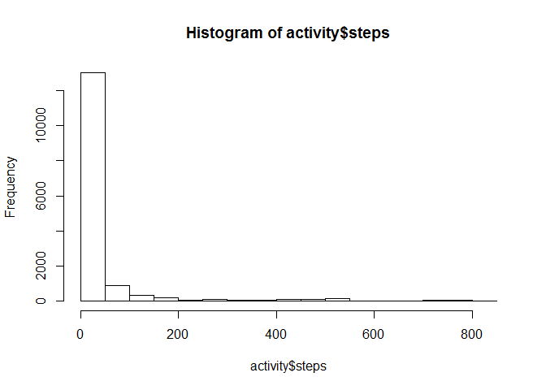
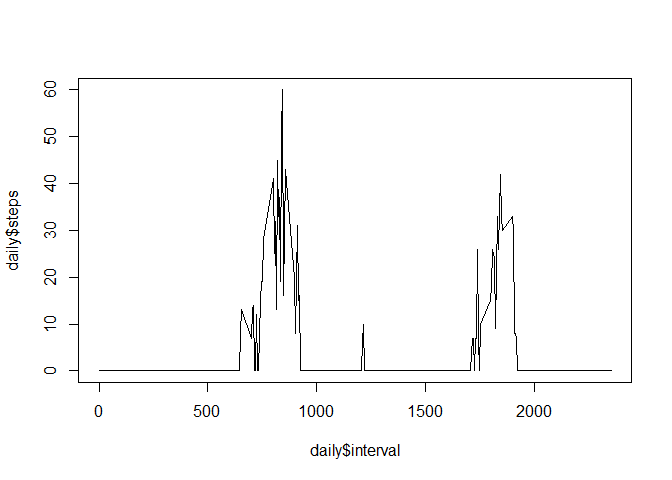
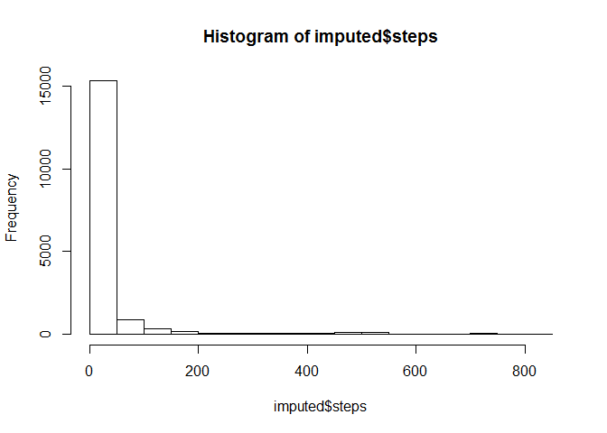
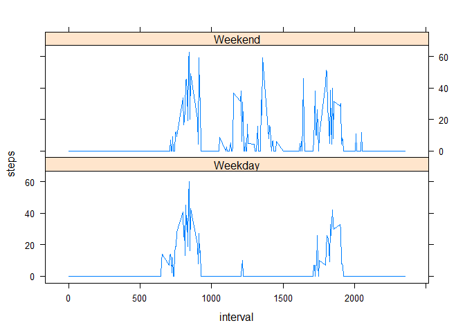

# Reproducible Research: Peer Assessment 1
This file contains weretoaster's submission for Assignment 1 of the  Reproducible Research course on Coursera.

## Loading and preprocessing the data
The dataset [Activity monitoring data](https://d396qusza40orc.cloudfront.net/repdata%2Fdata%2Factivity.zip) [52K] should be downloaded to the working directory.

The variables included in this dataset are:

* **steps**: Number of steps taking in a 5-minute interval (missing values are coded as `NA`)

* **date**: The date on which the measurement was taken in YYYY-MM-DD format

* **interval**: Identifier for the 5-minute interval in which measurement was taken

The following code reads the data from the .csv file and converts the date variable from factor format to date format.


```r
activity <- read.csv("activity.csv")
activity$date <- as.Date(activity$date, format = "%Y-%m-%d")
```

## What is mean total number of steps taken per day?

1) Make a histogram of the total number of steps taken each day:

```r
hist(activity$steps)
```

 

2 a) Calculate and report the mean total number of steps taken per day:

```r
mean(activity$steps, na.rm=TRUE)
```

```
## [1] 37.3826
```

2 b) Calculate and report the median total number of steps taken per day:

```r
median(activity$steps, na.rm=TRUE)
```

```
## [1] 0
```

## What is the average daily activity pattern?

1) Make a time series plot (i.e. type = "l") of the 5-minute interval (x-axis) and the average number of steps taken, averaged across all days (y-axis)

```r
daily <- aggregate(steps ~ interval, activity, median)
plot(daily$interval, daily$steps, type = "l")
```

 

2) Which 5-minute interval, on average across all the days in the dataset, contains the maximum number of steps?

```r
daily$interval[daily$steps == max(daily$steps)]
```

```
## [1] 845
```

## Imputing missing values


1) Calculate and report the total number of missing values in the dataset (i.e. the total number of rows with NAs)


```r
length(which(is.na(activity$steps)))
```

```
## [1] 2304
```

2) Devise a strategy for filling in all of the missing values in the dataset. The strategy does not need to be sophisticated. For example, you could use the mean/median for that day, or the mean for that 5-minute interval, etc.


```r
#My strategy is to loop through the activity dataset and replace each NA value with the corresponding average number of steps for that inverval (sourced from the 'daily' dataset created above).
```

3) Create a new dataset that is equal to the original dataset but with the missing data filled in.


```r
#My strategy is to loop through the activity dataset and replace each NA value with the correspondeing average number of steps for that inverval (sourced from the 'daily' dataset created to answer a previous question).

imputed <- activity
missing <- which(is.na(activity$steps))

for (i in missing) {
    imputed$steps[i] <- with(daily, steps[interval == imputed$interval[i]])
    } 
```

4) Make a histogram of the total number of steps taken each day and Calculate and report the mean and median total number of steps taken per day. Do these values differ from the estimates from the first part of the assignment? What is the impact of imputing missing data on the estimates of the total daily number of steps?

a) Make a histogram of the total number of steps taken each day:

```r
hist(imputed$steps)
```

 

2 a) Calculate and report the mean total number of steps taken per day:

```r
mean(imputed$steps, na.rm=TRUE)
```

```
## [1] 32.99954
```

2 b) Calculate and report the median total number of steps taken per day:

```r
median(imputed$steps, na.rm=TRUE)
```

```
## [1] 0
```

c) Do these values differ from the estimates from the first part of the assignment? What is the impact of imputing missing data on the estimates of the total daily number of steps?


```r
# Analysis of the impact of imputing missing data:

# The mean number of steps drops slightly (from 37.3826 to 32.99954) in the imputed dataset, due to the larger number of zero values. No change to the median, as zero is still the most frequent number of steps. The overall trend shown in the histogram remains the same.
```

## Are there differences in activity patterns between weekdays and weekends?

1) Create a new factor variable in the dataset with two levels -- "weekday" and "weekend" indicating whether a given date is a weekday or weekend day.

```r
imputed$day <- weekdays(imputed$date)
imputed$daytype <- ifelse(imputed$day %in% c("Saturday", "Sunday"), "Weekend", "Weekday")
```

2) Make a panel plot containing a time series plot (i.e. type = "l") of the 5-minute interval (x-axis) and the average number of steps taken, averaged across all weekday days or weekend days (y-axis). The plot should look something like the following, which was created using simulated data:

```r
imputed <- aggregate(steps ~ interval + daytype, imputed, median)

library(lattice)
xyplot(steps~interval|daytype, imputed, type = "l", layout = c(1,2))
```

 
